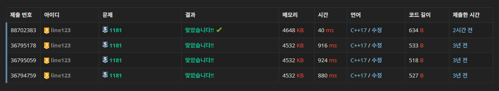

## 문제

알파벳 소문자로 이루어진 N개의 단어가 들어오면 아래와 같은 조건에 따라 정렬하는 프로그램을 작성하시오.  

1. 길이가 짧은 것부터  
2. 길이가 같으면 사전 순으로  

단, 중복된 단어는 하나만 남기고 제거해야 한다.

## 입력

첫째 줄에 단어의 개수 N이 주어진다. (1 ≤ N ≤ 20,000)  
둘째 줄부터 N개의 줄에 걸쳐 알파벳 소문자로 이루어진 단어가 한 줄에 하나씩 주어진다.  
주어지는 문자열의 길이는 50을 넘지 않는다.

## 출력

조건에 따라 정렬하여 단어들을 출력한다.

## 예제

### 예제 입력 1

```
13
but
i
wont
hesitate
no
more
no
more
it
cannot
wait
im
yours
```

### 예제 출력 1

```
i
im
it
no
but
more
wait
wont
yours
cannot
hesitate
```

---

## 풀이

### 문제 이해

길이가 짧은 것부터 정렬하되, 만약 길이가 같다면 사전 순으로 정렬하면 되는 문제다.  
사전 순은 알파벳 a ~ z까지 단어를 정렬하는 것을 의미한다.  

문제를 해결하기 전 고려해야할 점이 두가지 있다.  
> - 중복된 단어는 하나만 남겨야 한다.  
> - 정렬 기준이 길이 -> 사전 순이다.

### 문제 해결

#### `vector`를 이용한 입력 데이터 저장

입력받은 데이터를 저장하기 위해 `vector`를 사용했다.  
vector는 동적 배열로 크기가 고정되지 않아서 이렇게 단어의 개수가 N개 입력되는 문제에서 유용하다.  
안에 요소를 넣으려면 `push_back`을 이용하면 된다.  
```c++
vector<string> word;

cin >> str;
word.push_back(str);
```
취향에 따라 다른 것을 이용해도 무방하다.  

---

#### `sort`를 이용한 정렬

sort 알고리즘은 quick sort(퀵 정렬)을 기반으로 하여 평균 시간복잡도는 O(N log N)이다.  
이 sort를 사용 가능한 방법은 아래와 같다. 
| 코드                                       | 설명                     |
|-------------------------------------------|--------------------------|
| **sort(arr, arr+n);**                     | n번째까지                |
| **sort(v.begin(), v.end());**             | 처음부터 끝까지 (오름차순)  |
| **sort(v.begin(), v.end(), compare);**    | 사용자 정의 함수 사용    |
| **sort(v.begin(), v.end(), greater\<T>());** | 내림차순                |
| **sort(v.begin(), v.end(), less\<T>());**   | 오름차순 (default)       |

이중에서 우리가 사용할 것은 3번 째 사용자 정의 함수를 이용하는 것이다.  

```c++
bool compare(string a, string b) {
	if (a.size() == b.size()) {
		return a < b;    // 길이가 같다면 사전 순으로 
	}
	return a.size() < b.size();    // 길이가 다르다면 길이가 짧은 순으로 
}
```

사용자 정의 함수는 두 문자열(여기서는 a와 b)을 비교해서 정렬 순서를 결정한다.  
리턴 값이 `true`라면 a가 b보다 앞에 위치하게 되고, `false`라면 a가 b보다 뒤에 위치하는 점을 이용하면 된다.  
즉, 사전 순으로 정렬할 때 앞쪽에 오는 문자열의 부등호 값이 작은 것이다.  

예를 들어 vector에 ["apple", "cherry", "banana"]가 있다고 생각해보자.  
이 중에 길이가 같은 경우와 다른 경우만 확인해보자.  

> 1. 길이가 같은 경우 (a.size() == b.size())  
>
> 길이가 같은 "cherry"와 "banana"를 각각 a, b로 놓고 비교해보자.  
> banana가 사전 순으로 정렬하면 앞쪽에 오기 때문에 `a > b`다.  
> 따라서 return 값은 `false`가 되고, banana - cherry로 정렬된다.  
>

> 2. 길이가 다른 경우  
> 
> 길이가 다른 "apple"과 "cherry"를 각각 a, b로 놓고 비교해보다.  
> 두 문자열의 size는 각각 5, 6기 때문에 `a.size() < b.size()`다.  
> 따라서 return 값은 `true`가 되고, apple - cherry로 정렬된다.  

--- 

#### `unique`, `erase`를 이용한 중복 제거

unique는 정렬된 vector에서 연속된 중복 요소를 제거하는 함수다.  
그렇다고 중복되는걸 아예 지워버리는 것은 아니다.  
중복되지 않는 요소를 앞쪽으로 이동시키고, 중복된 요소들은 뒤쪽에 남긴 뒤 중복된 값이 시작되는 지점의 iterator를 반환한다.  
```c++
unique(word.begin(), word.end());

["apple", "apple", "banana", "banana", "cherry"]    // 정렬된 vector
["apple", "banana", "cherry", "apple", "banana"]    // unique 호출 후
// 참고로 unique 호출 후 뒤에 나오는 중복값의 순서는 보장되지 않음
```

따라서 뒤에 남은 요소도 제거하기 위해 erase 함수를 사용하게 된다.  
erase는 지정한 범위의 요소를 제거한 후, 제거된 마지막 요소 바로 다음 위치를 가르키는 iterator를 반환한다.  
```c++
word.erase(word.begin(), word.end());

["apple", "banana", "cherry", "apple", "banana"]    // unique 호출 후
["apple", "banana", "cherry"]                       // erase 호출 후
```

이제 unique 함수의 반환값을 이용하면 이 과정을 한 줄로 정리할 수 있게 된다.  
```c++
word.erase(unique(word.begin(), word.end()), word.end());
```

--- 

## 코드

```c++
#include <iostream>
#include <vector>
#include <algorithm>
using namespace std;

bool compare(string a, string b) {
	if (a.size() == b.size()) {
		return a < b;
	}
	return a.size() < b.size();
}

void solve() {
    int N;
	cin >> N;

	vector<string> word;

	for (int i = 0; i < N; i++) {
		string str;
		cin >> str;
		word.push_back(str);
	}

	sort(word.begin(), word.end(), compare);
    
    word.erase(unique(word.begin(), word.end()), word.end());

	for (const string &w : word)
        cout << w << '\n';
}

int main() {
    
    ios_base::sync_with_stdio(false);
	cin.tie(NULL);
	cout.tie(NULL);
    
	solve();

    return 0;
}
```

---


 
[1181번: 단어 정렬 (acmicpc.net)](https://www.acmicpc.net/problem/1181)  
[1181-단어 정렬 · HOKAGO-MEMORIES/BOJ-line123 (github.com)](https://github.com/HOKAGO-MEMORIES/BOJ-line123/tree/ed51c2c0431442cf8066359c552ad6f06f291b0b/%EB%B0%B1%EC%A4%80/Silver/1181.%E2%80%85%EB%8B%A8%EC%96%B4%E2%80%85%EC%A0%95%EB%A0%AC)  
